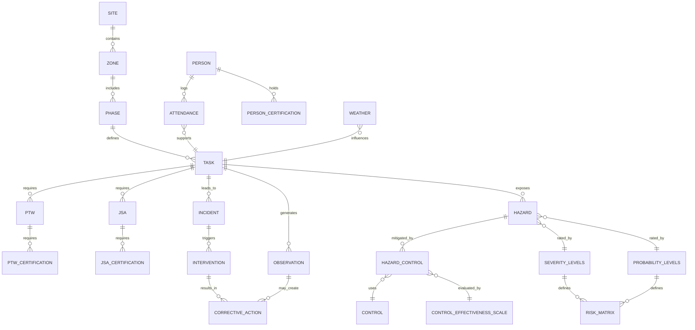

# 🦺 HSE Risk Intelligence — Project Portfolio

## 🌍 Real-World Value

The **HSE Risk Intelligence** system provides a comprehensive safety, hazard, and operational monitoring platform for industrial worksites.  
It integrates **attendance, tasks, hazards, incidents, observations, toolbox meetings, and corrective actions** into a centralized database, enabling:  

- Real-time operational oversight and daily KPI reporting  
- Task and hazard trend analysis  
- Incident root-cause analysis and intervention tracking  
- Evidence-based decision-making for site management and executives  
- Scalable architecture to include multiple sites and longitudinal safety insights  
- Future AI-assisted querying and reporting  

This project demonstrates **senior-level consultancy competencies** in database design, HSE risk management, and operational analytics.

---

## 📂 Repository Structure

## 📂 Repository Structure

- `/sql` — Schema creation, indexes, constraints  
- `/data` — Preloaded lookup tables and example transactional entries  
- `/manuals` — Database operations and data entry guidelines  
- `/reports` — Generated dashboards, KPI summaries, and compliance reports  
- `/app` — Future Shiny dashboards and analytics  
- `/notebooks` — Data exploration, validation scripts, simulations
- `README.md` — Project overview, conceptual model, repo structure, objectives
  
---

## 📌 Conceptual Risk Intelligence Model

**high-level task-centered ERD diagram**

  
**Conceptual Flow (simplified)**:
- The ERD shows how **tasks drive incidents and hazards**, which in turn trigger interventions and corrective actions.  
- Observations and weather influence incidents and tasks.  
- Controls mitigate hazards and can feed back into corrective actions.

---

## 📊 Operational Modules & Data Flow

| Module | Stage | Function | Status | Dashboard / Output |
|--------|-------|---------|--------|------------------|
| **Daily Safety & Attendance** | `Attendance & PPE Checks` | Logs worker presence, PPE compliance, and safety observations | ✅ Live | Daily KPI Dashboard |
| **Task & Hazard Management** | `Task Execution & JSA` | Track tasks, hazards, and controls; link to risk scoring | ✅ Live | KPI Trends, Risk Matrix |
| **Incident & Intervention Tracking** | `Incident → Intervention → Corrective Action` | Capture incidents, trigger interventions, monitor action closure | ✅ Live | Corrective Action Reports |
| **Toolbox Meetings** | `Safety Topics & Engagement` | Daily toolbox topics, attendance, and discussion logs | ✅ Live | Toolbox Dashboard |
| **Risk Analytics Engine** | `Risk Scoring & Trend Analysis` | Aggregate severity, probability, and control effectiveness into dynamic risk scores | 🟢 Planned | Predictive Risk Dashboard |
| **Multi-Site & Longitudinal Insights** | `Cross-Site & Phase Analysis` | Compare safety performance across sites and phases | 🟢 Planned | Cross-Site KPI Dashboards |
| **AI-Assisted Query Interface** | `Interactive Questioning & Reporting` | Future functionality: natural language or voice queries mapped to SQL reporting | 🔵 Future | Ad-hoc Reports, Automated Queries |

> **Note:** For MVP with one site, the app will focus on **daily KPIs dashboard** and executive overview. Other modules are conceptually included for future expansion.

---

## 📈 Executive Dashboard KPIs (MVP)

| KPI | Source Table | Notes |
|-----|--------------|------|
| High-risk tasks today | TASK + HAZARD + RISK_MATRIX | Show tasks exceeding risk threshold |
| Attendance | ATTENDANCE | Percent present vs expected |
| PPE Compliance | PPE_CHECKS | Percent compliant / non-compliant |
| JSA & PTW Completion | JSA, PTW | Tasks completed vs planned |
| Open Corrective Actions | CORRECTIVE_ACTION | Count of Open / In Progress / Overdue |
| Toolbox Attendance | TOOLBOX_MEETING | Number of attendees vs expected |
| Weather Summary | WEATHER | Wind, rain, temperature, solar load |

> Future KPI tabs can expand to multi-site comparisons, trend charts, and predictive risk scoring.

---

## 🛠 Tools & Techniques Used

### **Backend & Database**
- PostgreSQL (future-proofed for multi-site expansion)  
- Normalized tables with primary & foreign key relationships  
- Preloaded lookup dictionaries for standardization (e.g., PPE types, task categories, risk matrices)  

### **Analytics**
- Risk scoring: Severity × Probability × Control effectiveness  
- Daily KPI aggregation and reporting  
- Historical trend analysis (incidents, corrective actions, hazard types)  

### **Shiny App (Planned MVP)**
- Dashboard tab: Daily KPIs and executive overview  
- Data exploration tab (optional): Tasks, hazards, observations, incidents  
- AI query tab (future): Text / voice-driven SQL query generation and report creation  

---

## 📘 Documentation & Manuals

- **Database Operations Manual** → `/docs/Database_Operations_Manual.md`  
  Includes:  
  - Lookup tables and dictionaries  
  - Transactional table structures  
  - ERD and table relationships  
  - Data entry rules (daily, weekly, monthly, as-needed)  

- **Reports Folder** → `/reports/`  
  Includes:  
  - Generated KPI dashboards  
  - Daily / weekly summary PDFs  
  - Compliance and safety reports  

---

## 🎯 Key Objectives

- Maintain **real-time safety monitoring** with HSE intelligence  
- Enable **trend detection** for incidents, hazards, and corrective actions  
- Integrate **tasks, attendance, and toolbox meetings** for operational visibility  
- Provide a **scalable platform** for multi-site analysis  
- Build **foundation for AI-assisted query interface** and predictive risk insights  

---

## 👥 Audience & Use Cases

- Site managers / HSE officers  
- Project engineers / supervisors  
- Executive leadership / management  
- Data analysts exploring operational trends  
- Consultants or auditors assessing HSE compliance  

---

## 📬 Get Involved

- 🐛 [Open an issue](https://github.com/Euchie23/HSEQ_Risk_Intel/issues) for feedback, bugs, or suggestions  
- ✉️ [Email me](mailto:euchiejnpierre@gmail.com)  
- 💼 [Connect on LinkedIn](https://www.linkedin.com/in/euchiejnpierre/)  
