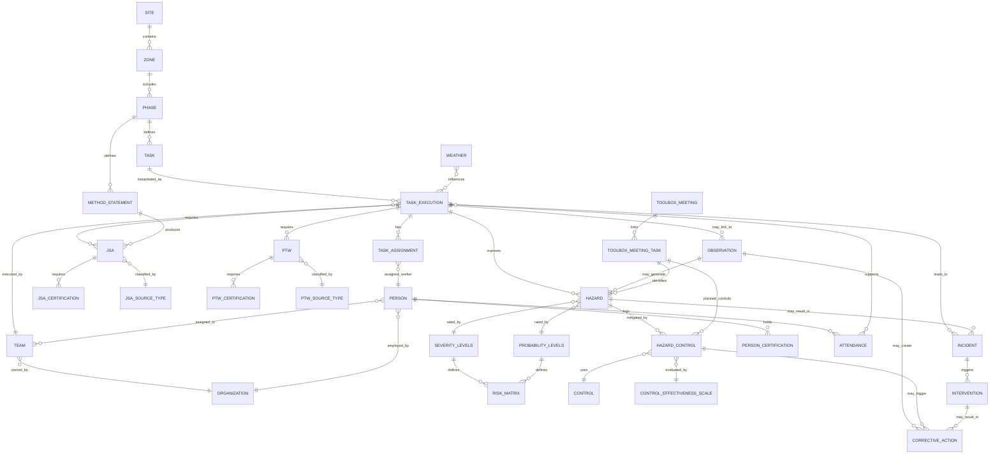

# 🦺 HSE Risk Intelligence — Project Portfolio

## 🌍 Real-World Value

The **HSE Risk Intelligence** system provides a comprehensive safety, hazard, and operational monitoring platform for industrial worksites.  
It integrates **task planning (task templates), real-world execution (task executions), workforce structures (organizations and teams), attendance, hazards, incidents, observations, toolbox meetings, and corrective actions**:  

- Real-time operational oversight and structured daily KPI reporting  
- Task, phase, and zone-level hazard trend analysis  
- Incident root-cause analysis and intervention lifecycle tracking  
- Planning-versus-execution validation through toolbox-to-task linkage  
- Evidence-based decision-making for site management and executives  
- Scalable architecture supporting multi-site and longitudinal safety insights
- Contractor and subcontractor performance tracking through organization and team structures   
- Future AI-assisted querying and predictive safety analytics   

This project demonstrates **senior-level consultancy competencies** in database design, HSE risk management, and operational analytics, **aligned with ISO 45001:2018 management standards and NEBOSH-level technical rigor.**.  

---

##🛠️ Core Functional Pillars

The system applies globally recognized methodologies for integrated safety management:

  - **Hazard Identification & Risk Assessment (HIRA):** Proactive assessment models based on NEBOSH risk profiling and ISO 45001 workflows.

  - **Administrative Control Governance:** Structured management of Permit to Work (PTW) and Job Safety Analysis (JSA) sequences.

  - **Risk Quantization:** Calibrated severity and probability scoring to prioritize high-risk activities.

  - **Control Effectiveness Evaluation:** Monitoring the hierarchy of controls and the "Check" phase of the PDCA cycle.

  - **Audit-Ready Traceability:** Ensuring all safety observations and overrides are timestamped and reproducible for regulatory review.
  
---

## 🔐 Data Ethics, Governance & Portfolio Use

This project is built from field-derived observations and reporting authored by the developer during routine site oversight. To ensure the highest standards of Professional Ethics and Information Security, the following governance protocols are applied:

  - **Data Minimization & Pseudonymization:** All Personally Identifiable Information (PII) within the `PERSON` and `CERTIFICATION` tables is pseudonymized.

  - **Contextual Abstraction:** Site and company identifiers in the `SITE` and `ZONE` tables are generalized to protect corporate anonymity.

  - **Technical Anonymization:** Numerical sequences for PTW, JSA, and certifications are abstracted to prevent the reconstruction of specific historical site activities.

  - **IP Protection:** Proprietary risk matrices and severity scales are translated into generalized lookup tables, ensuring that third-party intellectual property is never reproduced verbatim.

  - **Integrity of Operational Patterns:** The dataset reflects the authentic "logic" of how hazards and controls interact, providing a governed, relational database suitable for advanced analytics and future AI-assisted querying while maintaining total confidentiality.

---

## 📂 Repository Structure

- `/sql` — Schema creation, indexes, constraints  
- `/data` — Raw datasets and prefilled lookup tables 
- `/docs` — Documentation (manuals, ERDs, SOPs) 
- `/reports` — Generated dashboards, KPI summaries, and compliance reports  
- `/app` — Future Shiny dashboards and analytics  
- `/notebooks` — Data exploration, validation scripts, simulations
- `README.md` — Project overview, conceptual model, repo structure, objectives
  
---

##  Conceptual Risk Intelligence Model

**high-level operational risk intelligence ERD diagram**

```mermaid
erDiagram

    SITE ||--o{ ZONE : contains
    ZONE ||--o{ PHASE : includes

    PHASE ||--o{ TASK : defines
    TASK ||--o{ TASK_EXECUTION : instantiated_as

    TASK_EXECUTION }o--|| TEAM : executed_by
    TEAM }o--|| ORGANIZATION : owned_by

    PERSON }o--|| ORGANIZATION : employed_by
    PERSON }o--o{ TEAM : assigned_to

    TASK_EXECUTION ||--o{ TASK_ASSIGNMENT : has
    TASK_ASSIGNMENT }o--|| PERSON : assigned_worker

    TASK_EXECUTION ||--o{ PTW : requires
    TASK_EXECUTION ||--o{ JSA : requires

    PHASE ||--o{ METHOD_STATEMENT : defines
    METHOD_STATEMENT ||--o{ JSA : produces

    JSA ||--o{ JSA_CERTIFICATION : requires
    JSA }o--|| JSA_SOURCE_TYPE : classified_by

    PTW ||--o{ PTW_CERTIFICATION : requires
    PTW }o--|| PTW_SOURCE_TYPE : classified_by

    TASK_EXECUTION ||--o{ OBSERVATION : may_link_to
    TASK_EXECUTION ||--o{ HAZARD : exposes
    TASK_EXECUTION ||--o{ INCIDENT : leads_to

    OBSERVATION ||--o{ HAZARD : may_generate
    OBSERVATION ||--o{ CORRECTIVE_ACTION : may_create

    HAZARD ||--o{ HAZARD_CONTROL : mitigated_by
    HAZARD }o--|| SEVERITY_LEVELS : rated_by
    SEVERITY_LEVELS ||--o{ RISK_MATRIX : defines
    HAZARD }o--|| PROBABILITY_LEVELS : rated_by
    PROBABILITY_LEVELS ||--o{ RISK_MATRIX : defines
    HAZARD ||--o{ INCIDENT : may_result_in

    HAZARD_CONTROL }o--|| CONTROL : uses
    HAZARD_CONTROL }o--|| CONTROL_EFFECTIVENESS_SCALE : evaluated_by
    HAZARD_CONTROL ||--o{ CORRECTIVE_ACTION : may_trigger

    INCIDENT ||--o{ INTERVENTION : triggers
    INTERVENTION ||--o{ CORRECTIVE_ACTION : may_result_in

    TOOLBOX_MEETING ||--o{ TOOLBOX_MEETING_TASK : links
    TOOLBOX_MEETING_TASK ||--o{ HAZARD : identifies
    TOOLBOX_MEETING_TASK ||--o{ HAZARD_CONTROL : planned_controls

    PERSON ||--o{ PERSON_CERTIFICATION : holds
    PERSON ||--o{ ATTENDANCE : logs

    ATTENDANCE }o--o{ TASK_EXECUTION : supports

    WEATHER }o--o{ TASK_EXECUTION : influences
```

**Conceptual Flow (enhanced):**

- The ERD illustrates how task templates define planned work, while task executions represent real-world activities performed on site within the **Site → Zone → Phase hierarchy**.
- Observations may also exist independently to capture broader site risks not tied to specific task executions.
- Hazards may originate from **task execution exposure, observational findings, or pre-task toolbox discussions**.
- Hazard Controls are implemented and evaluated via the **Control Effectiveness Scale**.
- Residual risk is calculated for both hazards and controls to quantify remaining risk after mitigation.
- Corrective Actions are created:
  - Directly from observations
  - From hazard controls that fail effectiveness evaluation
  - Through incident → intervention pathways
- The loop continues until hazard is mitigated, corrective action is closed, and residual risk is reduced.
- Weather and environmental factors provide contextual exposure analysis at the task execution level.
- Legal-grade traceability of PTW and JSA documentation through source classification (Contractor vs Client) enables audit readiness and compliance validation in line with NEBOSH and ISO 45001 guidelines.

- Workforce structure is modeled through:
  - Organizations (who employs personnel)
  - Teams (who execute work operationally)
  - Task assignments (who performs each task execution)

👉 [How It Works (Simple Overview)](https://github.com/Euchie23/HSEQ_Risk_Intel/blob/main/HOW_IT_WORKS.md)

---

## 📊 Operational Modules & Data Flow

### Status Legend

| Status | Meaning |
|--------|---------|
| 🟢 | Schema Implemented |
| 🟡 | Data Population / Refinement in Progress |
| 🔵 | Future Enhancement |

| Module | Stage | Function | Status | Dashboard / Output |
|--------|-------|---------|--------|------------------|
| **Daily Safety & Attendance** | `Attendance & PPE Checks` | Logs worker presence, PPE compliance, and safety observations | 🟢 | Daily KPI Dashboard |
| **Task & Hazard Management** | `Task Execution & JSA` | Track tasks, hazards, and controls; link to risk scoring | 🟢 | KPI Trends, Risk Matrix |
| **Incident & Intervention Tracking** | `Incident → Intervention → Corrective Action` | Capture incidents, trigger interventions, monitor action closure | 🟢 | Corrective Action Reports |
|**Observational Intelligence** | `Observations → Hazards → ObservationZones` | Track zones where hazards are most observed | 🟢 | KPI Observation Hotspots |
| **Toolbox Meetings** | `Safety Topics & Engagement` | Daily toolbox topics, attendance, and discussion logs | 🟢 | Toolbox Dashboard |
| **Risk Analytics Engine** | `Risk Scoring & Trend Analysis` | Aggregate severity, probability, and control effectiveness into dynamic risk scores | 🟢 | Predictive Risk Dashboard |
| **Multi-Site & Longitudinal Insights** | `Cross-Site & Phase Analysis` | Compare safety performance across sites and phases | 🔵  | Cross-Site KPI Dashboards |
| **AI-Assisted Query Interface** | `Interactive Questioning & Reporting` | Future functionality: natural language or voice queries mapped to SQL reporting | 🔵 | Ad-hoc Reports, Automated Queries |

> **Note:** For MVP with one site, the app will focus on **daily KPIs dashboard** and executive overview. Other modules are conceptually included for future expansion.

---

## 📈 Executive Dashboard KPIs (MVP)

| KPI | Source Table | Notes |
|-----|--------------|------|
| High-risk tasks today | TASK_EXECUTION + HAZARD + RISK_MATRIX | Show active high-risk work |
| Attendance | ATTENDANCE | Percent present vs expected |
| PPE Compliance | PPE_CHECKS | Percent compliant / non-compliant |
| JSA & PTW Completion | TASK_EXECUTION + JSA + PTW | Linked to executed work |
| Open Corrective Actions | CORRECTIVE_ACTION | Count of Open / In Progress / Overdue |
| Observation Hotspots | OBSERVATION, OBSERVATION_ZONE | Zones with repeated issues |
| Toolbox Hazard Topics | TOOLBOX_MEETING | Number of attendees vs expected |
| Weather Summary | WEATHER | Environmental exposure |
| Contractor Risk Exposure | INCIDENT + ORGANIZATION | Identify high-risk contractors |
| Team Performance | TASK_EXECUTION + TEAM | Compare team safety performance |

> Future KPI tabs can expand to multi-site comparisons, trend charts, and predictive risk scoring.

---

## 🛠 Tools & Techniques Used

### **Backend & Database**
- PostgreSQL (future-proofed for multi-site expansion)  
- Normalized tables with primary & foreign key relationships  
- Preloaded lookup dictionaries for standardization (e.g., PPE types, task categories, risk matrices)  

### **Analytics**
- Risk scoring incorporates severity, probability, and control effectiveness to support inherent and residual risk evaluation  
- Daily KPI aggregation and reporting  
- Historical trend analysis (incidents, corrective actions, hazard types)  

### **Shiny App (Planned MVP)**
- Dashboard tab: Daily KPIs and executive overview  
- Data exploration tab (optional): Tasks, hazards, observations, incidents  
- AI query tab (future): Text / voice-driven SQL query generation and report creation

> **Certifications Alignment**: Risk scoring, hazard identification, PTW/JSA governance, and corrective action logic are explicitly aligned with **NEBOSH General Certificate and ISO 45001:2018 standards**.

---

## 📘 Documentation & Manuals

- [**Database Operations Manual**](https://github.com/Euchie23/HSEQ_Risk_Intel/blob/main/docs/Database_Operations_Manual.md)   
  Includes:  
  - Lookup tables and dictionaries  
  - Transactional table structures  
  - ERD and table relationships  
  - Data entry rules (daily, weekly, monthly, as-needed)  

- **Reports Folder** → `/reports/`  
  Includes:  
  - Generated KPI dashboards  
  - Daily / weekly summary PDFs  
  - Compliance and safety reports  

---

## 🎯 Key Objectives

- Maintain structured real-time safety monitoring aligned with **NEBOSH & ISO 45001 principles** 
- Enable trend detection for incidents, hazards, and corrective actions  
- Preserve quantified risk engine scoring logic  
- Support planning-versus-execution validation through toolbox linkage  
- Integrate tasks, attendance, observations, and controls for operational visibility  
- Provide a scalable foundation for multi-site and longitudinal analysis  
- Establish groundwork for AI-assisted querying and predictive risk modeling  

---

## 👥 Audience & Use Cases

- Site managers / HSE officers  
- Project engineers / supervisors  
- Executive leadership / management  
- Data analysts exploring operational trends  
- Consultants or auditors assessing HSE compliance  

---

## 📬 Get Involved

- 🐛 [Open an issue](https://github.com/Euchie23/HSEQ_Risk_Intel/issues) for feedback, bugs, or suggestions  
- ✉️ [Email me](mailto:euchiejnpierre@gmail.com)  
- 💼 [Connect on LinkedIn](https://www.linkedin.com/in/euchiejnpierre/)  
