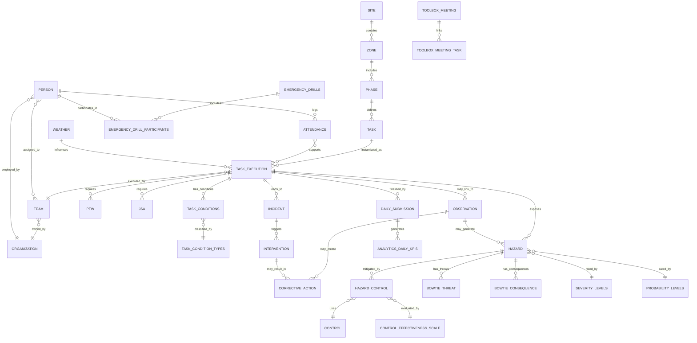

# 🦺 HSE Risk Intelligence — Project Portfolio

## 🌍 Real-World Value

The **HSE Risk Intelligence** system provides a comprehensive safety, hazard, and operational monitoring platform for industrial worksites.  
It integrates **task planning (task definitions/templates), and real-world execution (task executions), workforce structures (organizations and teams), attendance, hazards, incidents, observations, toolbox meetings, corrective actions, and automated risk intelligence layers**:

- Real-time operational oversight and structured daily KPI reporting  
- Task, phase, and zone-level hazard trend analysis  
- Incident root-cause analysis and intervention lifecycle tracking  
- Planning-versus-execution validation through toolbox-to-task linkage  
- Evidence-based decision-making for site management and executives  
- Scalable architecture supporting multi-site and longitudinal safety insights  
- Contractor and subcontractor performance tracking through organization and team structures  
- **Event-driven automation for hazard detection, corrective actions, and workflow validation**  
- **Bowtie-based hazard modeling with barrier integrity evaluation**  
- **Dynamic risk scoring combining conditions, controls, and barrier effectiveness**  
- **Scenario simulation engine for predictive risk analysis (what-if modelling)**  
- Future AI-assisted querying and predictive safety analytics  

This project demonstrates **senior-level consultancy competencies** in database design, HSE risk management, and operational analytics, **aligned with ISO 45001:2018 management standards, NEBOSH methodology, and barrier-based risk practices used by major oil & gas operators (BP, Shell, TotalEnergies)**.

---

## 🛠️ Core Functional Pillars

The system applies globally recognized methodologies for integrated safety management:

- **Hazard Identification & Risk Assessment (HIRA):** Proactive assessment models based on NEBOSH risk profiling and ISO 45001 workflows.

- **Bowtie Risk Modeling:** Structured hazard analysis mapping threats, barriers, and consequences.

- **Barrier Integrity & Effectiveness Evaluation:** Quantitative scoring of controls aligned with barrier-based safety philosophy.

- **Administrative Control Governance:** Structured management of Permit to Work (PTW) and Job Safety Analysis (JSA) sequences.

- **Risk Quantization:** Calibrated scoring using **conditions + controls + barrier integrity adjustments**.

- **Event-Driven Automation:** Trigger-based system for hazard creation, corrective actions, and workflow enforcement.

- **Scenario Simulation Engine:** Enables proactive “what-if” analysis for barrier failure or control degradation.

- **Audit-Ready Traceability:** Ensuring all safety observations, overrides, and automation actions are timestamped and reproducible.

---

## 🔐 Data Ethics, Governance & Portfolio Use

This project is built from field-derived observations and reporting authored by the developer during routine site oversight on a large-scale construction project involving the development of aviation fuel infrastructure near a Caribbean-based international airport environment.

To ensure the highest standards of Professional Ethics and Information Security, the following governance protocols are applied:

- **Data Minimization & Pseudonymization:** All Personally Identifiable Information (PII) within the `PERSON` and `CERTIFICATION` tables is pseudonymized.

- **Contextual Abstraction:** Site and company identifiers in the `SITE` and `ZONE` tables are generalized to protect corporate anonymity.

- **Technical Anonymization:** Numerical sequences for PTW, JSA, and certifications are abstracted to prevent reconstruction of specific historical site activities.

- **IP Protection:** Proprietary risk matrices and severity scales are translated into generalized lookup tables.

- **Integrity of Operational Patterns:** The dataset preserves real-world hazard-control relationships for advanced analytics and future AI-assisted querying.

---

## 📂 Repository Structure

- `/sql` — Schema creation, indexes, constraints  
- `/data` — Raw datasets and prefilled lookup tables  
- `/docs` — Documentation (manuals, ERDs, SOPs)  
- `/reports` — Generated dashboards, KPI summaries, compliance reports, and PDF outputs  
- `/app` — Streamlit guided data entry application  
- `/automation` — Event-driven automation engine (triggers, validators, lifecycle, notifications)  
- `/modules` — Risk engine, simulation engine, reporting engine, indicator engine  
- `/notebooks` — Data exploration, validation scripts, simulations  
- `README.md` — Project overview  

---

## Conceptual Risk Intelligence Model (Enterprise ERD)

**high-level operational risk intelligence ERD diagram**

```mermaid
erDiagram

    SITE ||--o{ ZONE : contains
    ZONE ||--o{ PHASE : includes

    PHASE ||--o{ TASK : defines
    TASK ||--o{ TASK_EXECUTION : instantiated_as

    TASK_EXECUTION }o--|| TEAM : executed_by
    TEAM }o--|| ORGANIZATION : owned_by

    PERSON }o--|| ORGANIZATION : employed_by
    PERSON }o--o{ TEAM : assigned_to

    PERSON ||--o{ ATTENDANCE : logs
    ATTENDANCE }o--o{ TASK_EXECUTION : supports

    TASK_EXECUTION ||--o{ TASK_CONDITIONS : has_conditions
    TASK_CONDITIONS }o--|| TASK_CONDITION_TYPES : classified_by

    TASK_EXECUTION ||--o{ PTW : requires
    TASK_EXECUTION ||--o{ JSA : requires

    TASK_EXECUTION ||--o{ OBSERVATION : may_link_to
    TASK_EXECUTION ||--o{ HAZARD : exposes
    TASK_EXECUTION ||--o{ INCIDENT : leads_to

    OBSERVATION ||--o{ HAZARD : may_generate
    OBSERVATION ||--o{ CORRECTIVE_ACTION : may_create

    HAZARD ||--o{ HAZARD_CONTROL : mitigated_by
    HAZARD ||--o{ BOWTIE_THREAT : has_threats
    HAZARD ||--o{ BOWTIE_CONSEQUENCE : has_consequences

    HAZARD_CONTROL }o--|| CONTROL : uses
    HAZARD_CONTROL }o--|| CONTROL_EFFECTIVENESS_SCALE : evaluated_by

    HAZARD }o--|| SEVERITY_LEVELS : rated_by
    HAZARD }o--|| PROBABILITY_LEVELS : rated_by

    INCIDENT ||--o{ INTERVENTION : triggers
    INTERVENTION ||--o{ CORRECTIVE_ACTION : may_result_in

    TOOLBOX_MEETING ||--o{ TOOLBOX_MEETING_TASK : links

    WEATHER ||--o{ TASK_EXECUTION : influences

    TASK_EXECUTION ||--o{ DAILY_SUBMISSION : finalized_by

    EMERGENCY_DRILLS ||--o{ EMERGENCY_DRILL_PARTICIPANTS : includes
    PERSON ||--o{ EMERGENCY_DRILL_PARTICIPANTS : participates_in

    DAILY_SUBMISSION ||--o{ ANALYTICS_DAILY_KPIS : generates
```

## Conceptual Flow (Enterprise Enhanced)

- Tasks define planned work, while **task executions represent real-world operations**.

- Each task execution is enriched with **environmental and operational conditions** (e.g., working at height, confined space), captured through `task_conditions`.

- These conditions serve as primary inputs into the **Risk Engine**, influencing hazard identification and base risk scoring.

- Hazards are generated from:
  - Task execution exposure  
  - Observations  
  - Toolbox discussions  
  - Automated condition-based triggers  

- Hazards are structured using **Bowtie methodology**:
  - Threats (causes)
  - Barriers (controls)
  - Consequences (outcomes)

- Controls are evaluated using **effectiveness scales**, forming the basis of **barrier integrity scoring**.

- Risk is dynamically calculated using:
  - Conditions (task_conditions)
  - Control effectiveness
  - Barrier integrity penalties

- A **Simulation Engine** allows predictive analysis by modifying barrier effectiveness and simulating risk escalation.

- An **Automation Layer**:
  - Detects high-risk conditions
  - Creates hazards and corrective actions automatically
  - Enforces workflow validations

- **Emergency Drills** provide periodic validation of preparedness and response capability.

- **Daily Submission** acts as a control gate:
  - Validates completeness
  - Locks records
  - Triggers KPI persistence

- **Indicator Engine** aggregates:
  - Leading indicators (PPE, hazards)
  - Lagging indicators (incidents, actions)
  - Barrier indicators
  - Predictive indicators

- These are stored in `analytics.daily_kpis` and used by the **Management Dashboard**.

- The system operates as a **closed-loop intelligence cycle**:
  Data Entry → Risk Evaluation → Automation → Validation → Reporting → Analytics → Decision Support

👉 [How It Works (Simple Overview)](https://github.com/Euchie23/HSEQ_Risk_Intel/blob/main/HOW_IT_WORKS.md)

---

---

## 📊 Operational Modules & Data Flow

### Status Legend

| Status | Meaning |
|--------|---------|
| 🟢 | Fully Implemented |
| 🟡 | Refinement / UI in Progress |
| 🔵 | Future Enhancement |

| Module | Stage | Function | Status | Dashboard / Output |
|--------|-------|---------|--------|------------------|
| **Daily Safety & Attendance** | `PPE & Presence` | Logs worker presence, PPE compliance, and safety observations | 🟢 | Daily KPI Dashboard |
| **Task & Hazard Management** | `Execution & Risk` | Track tasks, hazards, controls, and task conditions; link to dynamic risk scoring | 🟢 | KPI Trends, Risk Matrix |
| **Incident & Intervention Tracking** | `Incident → Intervention → Corrective Action` | Capture incidents, trigger interventions, monitor action lifecycle | 🟢 | Corrective Action Reports |
| **Observational Intelligence** | `Observations → Hazards → Zones` | Track zones where hazards are most observed and convert observations into risk data | 🟢 | KPI Observation Hotspots |
| **Toolbox Meetings** | `Safety Topics & Engagement` | Daily toolbox topics, attendance, and discussion logs linked to hazards and tasks | 🟢 | Toolbox Dashboard |
| **Emergency Preparedness** | `Emergency Drills & Participation` | Capture emergency drill execution, participants, and lessons learned for compliance | 🟢 | Compliance Reports |
| **Risk Intelligence Engine** | `Conditions + Controls + Barriers` | Multi-factor risk scoring combining task conditions, control effectiveness, and barrier integrity | 🟢 | Risk Levels, Decision Support |
| **Bowtie & Barrier Modeling** | `Threat–Barrier–Consequence` | Structured hazard modeling with barrier integrity scoring | 🟢 | Barrier Analysis |
| **Simulation Engine** | `What-if Risk Scenarios` | Predictive modeling of risk escalation under changing control/barrier conditions | 🟢 | Predictive Risk Insights |
| **Automation Engine** | `Event-Driven Actions` | Trigger-based hazard creation, corrective actions, and workflow validation | 🟢 | Auto Actions / Alerts |
| **Indicator Engine** | `Leading / Lagging / Predictive KPIs` | Aggregates operational data into structured KPIs and persists daily metrics | 🟢 | KPI Tables (`analytics.daily_kpis`) |
| **Multi-Site & Longitudinal Insights** | `Cross-Site & Phase Analysis` | Compare safety performance across sites and phases | 🔵 | Cross-Site KPI Dashboards |
| **AI-Assisted Query Interface** | `Interactive Questioning & Reporting` | Future functionality: natural language queries mapped to SQL reporting | 🔵 | Ad-hoc Reports, Automated Queries |

> **Note:** For MVP with one site, the app focuses on **daily operations, risk intelligence, and KPI generation**, with management dashboards consuming persisted analytics data.

---

## 📈 Executive Dashboard KPIs (MVP)

| KPI | Source Table | Notes |
|-----|--------------|------|
| High-risk tasks today | TASK_EXECUTION + HAZARD + Risk Engine | Includes barrier-adjusted risk scoring |
| Attendance | ATTENDANCE | Percent present vs expected |
| PPE Compliance | PPE_CHECKS | Leading indicator of safety compliance |
| Hazard Identification Rate | HAZARD | Leading indicator of proactive risk detection |
| Open Corrective Actions | CORRECTIVE_ACTION | Lagging indicator of unresolved risk |
| Observation Hotspots | OBSERVATION, OBSERVATION_ZONE | Zones with repeated safety issues |
| Toolbox Engagement | TOOLBOX_MEETING | Participation vs expected attendance |
| Weather Exposure | WEATHER | Environmental risk context |
| Contractor Risk Exposure | INCIDENT + ORGANIZATION | Identify high-risk contractors |
| Team Performance | TASK_EXECUTION + TEAM | Compare team-level safety performance |
| Weak Barriers | HAZARD_CONTROL | Barrier integrity indicator |
| Simulation Risk Escalation | Simulation Engine | Predictive indicator of risk increase |

> Future KPI tabs will expand to trend analysis, predictive modeling, and cross-site benchmarking.

---

## 🛠 Tools & Techniques Used

### **Backend & Database**
- PostgreSQL (future-proofed for multi-site expansion)  
- Normalized tables with primary & foreign key relationships  
- Preloaded lookup dictionaries for standardization (e.g., PPE types, task categories, risk matrices, condition thresholds)  

### **Analytics & Risk Engineering**
- Risk scoring integrates **task conditions, control effectiveness, and barrier integrity**  
- Bowtie methodology for structured hazard modeling  
- Barrier scoring aligned with industry safety practices (BP / Shell / TotalEnergies approach)  
- Scenario simulation for predictive risk analysis  
- Daily KPI aggregation and persistence (`analytics.daily_kpis`)  
- Historical trend analysis (incidents, hazards, corrective actions, barrier degradation)  

### **Application Layer (Streamlit)**
- Guided data entry workflows (tasks, hazards, PPE, observations)  
- Real-time validation and automation triggers  
- Integrated reporting (CSV, PDF-ready structure)  

> **Certifications Alignment:** Risk scoring, hazard identification, PTW/JSA governance, automation logic, and barrier modeling align with **NEBOSH General Certificate, ISO 45001:2018, and barrier-based risk management practices used in major oil & gas operations**.

---

## 📘 Documentation & Manuals

- [**Database Operations Manual**](https://github.com/Euchie23/HSEQ_Risk_Intel/blob/main/docs/Database_Operations_Manual.md)   
  Includes:  
  - Lookup tables and dictionaries  
  - Transactional table structures  
  - ERD and table relationships  
  - Data entry rules (daily, weekly, monthly, as-needed)  

- **Reports Folder** → `/reports/`  
  Includes:  
  - Generated KPI dashboards  
  - Daily / weekly summary PDFs  
  - Compliance and safety reports  

---

## 🎯 Key Objectives

- Maintain structured real-time safety monitoring aligned with **NEBOSH & ISO 45001 principles**  
- Enable proactive and predictive risk identification using conditions, controls, and barrier analysis  
- Integrate automation for hazard detection and corrective action workflows  
- Support decision-making through simulation and KPI analytics  
- Preserve quantified risk engine and barrier scoring logic  
- Provide a scalable foundation for multi-site and longitudinal analysis  
- Establish groundwork for AI-assisted querying and predictive risk modeling  

---

## 👥 Audience & Use Cases

- Site managers / HSE officers  
- Project engineers / supervisors  
- Executive leadership / management  
- Data analysts exploring operational trends  
- Consultants or auditors assessing HSE compliance  

---
## 📬 Get Involved

- 🐛 [Open an issue](https://github.com/Euchie23/HSEQ_Risk_Intel/issues) for feedback, bugs, or suggestions  
- ✉️ [Email me](mailto:euchiejnpierre@gmail.com)  
- 💼 [Connect on LinkedIn](https://www.linkedin.com/in/euchiejnpierre/)  
