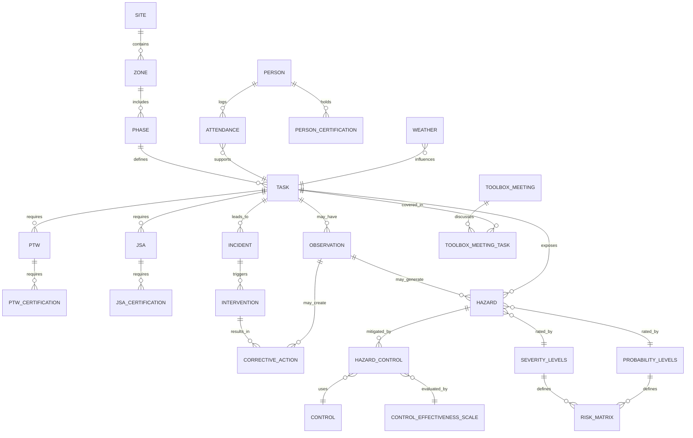

# 🦺 HSE Risk Intelligence — Project Portfolio

## 🌍 Real-World Value

The **HSE Risk Intelligence** system provides a comprehensive safety, hazard, and operational monitoring platform for industrial worksites.  
It integrates **attendance, tasks, hazards, incidents, observations, toolbox meetings, and corrective actions** into a centralized database, enabling:  

- Real-time operational oversight and daily KPI reporting  
- Task and hazard trend analysis  
- Incident root-cause analysis and intervention tracking  
- Evidence-based decision-making for site management and executives  
- Scalable architecture to include multiple sites and longitudinal safety insights  
- Future AI-assisted querying and reporting  

This project demonstrates **senior-level consultancy competencies** in database design, HSE risk management, and operational analytics.

---

## 🔐 Data Ethics, Governance & Portfolio Use

This project is built from field-derived HSE observations and operational reporting authored by the developer during routine site oversight.  
It is **not** exported from any proprietary company system or database.

All tasks, hazards, observations, incidents, toolbox topics, and operational records originate from daily HSE reports and PPE verification sheets personally prepared as part of on-site responsibilities.

For portfolio and GitHub publication, the following governance rules are applied:

- All workers’ names are anonymized
- Worker names are anonymized
- Site and company identifiers are generalized
- PTW, JSA, and certification numbers are anonymized
- Company-specific risk matrices, severity scales, and probability classifications are **abstracted** into generic lookup tables
- Observations and toolbox discussions reflect operational reality without exposing proprietary frameworks
- No proprietary documents, templates, or internal systems are reproduced

The dataset therefore represents a **structured abstraction of real operational patterns** while fully preserving confidentiality.

This demonstrates how real-world HSE intelligence can be translated into a governed, relational database suitable for analytics, dashboards, and future AI-assisted querying — while adhering to professional data ethics and privacy standards.

---

## 📂 Repository Structure

- `/sql` — Schema creation, indexes, constraints  
- `/data` — Raw datasets and prefilled lookup tables 
- `/docs` — Documentation (manuals, ERDs, SOPs) 
- `/reports` — Generated dashboards, KPI summaries, and compliance reports  
- `/app` — Future Shiny dashboards and analytics  
- `/notebooks` — Data exploration, validation scripts, simulations
- `README.md` — Project overview, conceptual model, repo structure, objectives
  
---

## 📌 Conceptual Risk Intelligence Model

**high-level operational risk intelligence ERD diagram**

**Conceptual Flow (simplified)**:
- The ERD shows how **tasks and observations drive incidents and hazards**, which in turn trigger interventions and hazard controls.  
- Observations and weather can influence incidents, tasks as well as corrective actions .  
- Controls mitigate hazards and can feed back into corrective actions.

---

## 📊 Operational Modules & Data Flow

| Module | Stage | Function | Status | Dashboard / Output |
|--------|-------|---------|--------|------------------|
| **Daily Safety & Attendance** | `Attendance & PPE Checks` | Logs worker presence, PPE compliance, and safety observations | 🟢 Planned | Daily KPI Dashboard |
| **Task & Hazard Management** | `Task Execution & JSA` | Track tasks, hazards, and controls; link to risk scoring | 🟢 Planned | KPI Trends, Risk Matrix |
| **Incident & Intervention Tracking** | `Incident → Intervention → Corrective Action` | Capture incidents, trigger interventions, monitor action closure | 🟢 Planned | Corrective Action Reports |
|**Observational Intelligence** | `Observations → Hazards → ObservationZones` | Track zones where hazards are most observed | 🟢 Planned | KPI Observation Hotspots |
| **Toolbox Meetings** | `Safety Topics & Engagement` | Daily toolbox topics, attendance, and discussion logs | 🟢 Planned | Toolbox Dashboard |
| **Risk Analytics Engine** | `Risk Scoring & Trend Analysis` | Aggregate severity, probability, and control effectiveness into dynamic risk scores | 🟢 Planned | Predictive Risk Dashboard |
| **Multi-Site & Longitudinal Insights** | `Cross-Site & Phase Analysis` | Compare safety performance across sites and phases | 🟢 Planned | Cross-Site KPI Dashboards |
| **AI-Assisted Query Interface** | `Interactive Questioning & Reporting` | Future functionality: natural language or voice queries mapped to SQL reporting | 🔵 Future | Ad-hoc Reports, Automated Queries |

> **Note:** For MVP with one site, the app will focus on **daily KPIs dashboard** and executive overview. Other modules are conceptually included for future expansion.

---

## 📈 Executive Dashboard KPIs (MVP)

| KPI | Source Table | Notes |
|-----|--------------|------|
| High-risk tasks today | TASK + HAZARD + RISK_MATRIX | Show tasks exceeding risk threshold |
| Attendance | ATTENDANCE | Percent present vs expected |
| PPE Compliance | PPE_CHECKS | Percent compliant / non-compliant |
| JSA & PTW Completion | JSA, PTW | Tasks completed vs planned |
| Open Corrective Actions | CORRECTIVE_ACTION | Count of Open / In Progress / Overdue |
| Observation Hotspots | OBSERVATION, OBSERVATION_ZONE | Zones with repeated issues | 
| Toolbox Hazard Topics | TOOLBOX_MEETING | Number of attendees vs expected |
| Weather Summary | WEATHER | Wind, rain, temperature, solar load |

> Future KPI tabs can expand to multi-site comparisons, trend charts, and predictive risk scoring.

---

## 🛠 Tools & Techniques Used

### **Backend & Database**
- PostgreSQL (future-proofed for multi-site expansion)  
- Normalized tables with primary & foreign key relationships  
- Preloaded lookup dictionaries for standardization (e.g., PPE types, task categories, risk matrices)  

### **Analytics**
- Risk scoring: Severity × Probability × Control effectiveness  
- Daily KPI aggregation and reporting  
- Historical trend analysis (incidents, corrective actions, hazard types)  

### **Shiny App (Planned MVP)**
- Dashboard tab: Daily KPIs and executive overview  
- Data exploration tab (optional): Tasks, hazards, observations, incidents  
- AI query tab (future): Text / voice-driven SQL query generation and report creation  

---

## 📘 Documentation & Manuals

- **Database Operations Manual** → `/docs/Database_Operations_Manual.md`  
  Includes:  
  - Lookup tables and dictionaries  
  - Transactional table structures  
  - ERD and table relationships  
  - Data entry rules (daily, weekly, monthly, as-needed)  

- **Reports Folder** → `/reports/`  
  Includes:  
  - Generated KPI dashboards  
  - Daily / weekly summary PDFs  
  - Compliance and safety reports  

---

## 🎯 Key Objectives

- Maintain **real-time safety monitoring** with HSE intelligence  
- Enable **trend detection** for incidents, hazards, and corrective actions
- Preserve **risk engine scoring** logic 
- Integrate **tasks, attendance, and toolbox meetings** for operational visibility  
- Provide a **scalable platform** for multi-site analysis  
- Build **foundation for AI-assisted query interface** and predictive risk insights  

---

## 👥 Audience & Use Cases

- Site managers / HSE officers  
- Project engineers / supervisors  
- Executive leadership / management  
- Data analysts exploring operational trends  
- Consultants or auditors assessing HSE compliance  

---

## 📬 Get Involved

- 🐛 [Open an issue](https://github.com/Euchie23/HSEQ_Risk_Intel/issues) for feedback, bugs, or suggestions  
- ✉️ [Email me](mailto:euchiejnpierre@gmail.com)  
- 💼 [Connect on LinkedIn](https://www.linkedin.com/in/euchiejnpierre/)  
